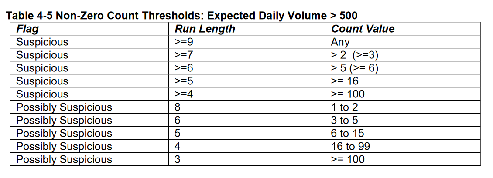

```{r setup, include=FALSE}
knitr::opts_chunk$set(echo = TRUE)
```


My home town, Madison (Wis.), has automated bike counters on two of the city's busiest bike paths, the Southwest Path and the Capital City Trail. The data is being made available with hourly counts on Madison's Open Data portal. In this post I will combine this data with climate data to investigate the relationship between bike counts, temperature, and precipitation. In this first part, I will prepare the bike count data and perform a number of quality checks.

## Preparations
I will heavily rely on `tidyverse` packages, including `lubridate` and `purr`. Other packages include the `rnoaa` package for the climate data and `timeDate` for dealing with holidays. For the bike counts all that is needed are the `tidyverse` and `timedate` packages, but I'll load the others ones anyway.

```{r message = FALSE}
library(tidyverse)
library(purrr)
library(lubridate)
library(rnoaa)
library(timeDate)
```

## Getting the bike count data
CSV files for each counter can be downloaded right from the portal. The files contain three columns, one of them a meaningless object id, which I will skip in the import. I'll add a variable of the location of the counter and then combine the two: 
```{r} 
cc_counts <- read_csv("https://opendata.arcgis.com/datasets/367cb53685c74628b4975d8f65d20748_0.csv", col_types = "ci-") %>% mutate(location = "Cap City at North Shore")

sw_counts <- read_csv("https://opendata.arcgis.com/datasets/8860784eb30e4a45a6f853b5f81949f2_0.csv", col_types = "ci-") %>% mutate(location = "SW Path at Randall")

counts <- bind_rows(cc_counts, sw_counts)
```
A quick data check shows that the data is relatively tidy.

```{r}
summary(counts)
```

There are a few `NA` values in the counts. I first thought they may be a random malfunction, let's take a look at when and where these occur:
```{r}
x <- which(is.na(counts$Count))
counts[x,]
```
Notice anything about the dates? It's the switch to daylight savings time (DST)! There's no count for 2 am on those days because there is no 2 am. The fifth row is the only that doesn't quite fit this, but it must also be DST-related. Conclusion: It's fine to just drop these NAs.

The next step is to convert the date and time variable, which currently is stored as a character. I'll use `lubridate` to fix this. I'm also specifying the time zone and adding an `dayofweek` and a weekend/weekday indicator variable, which will come in handy later.
```{r}
counts2 <- counts %>% 
  drop_na %>% 
  mutate(Count_Date = mdy_hm(str_sub(Count_Date, 6), tz = "US/Central")) %>% 
  mutate(dayofweek = wday(Count_Date, label = TRUE)) %>% 
  mutate(weekendind = ifelse(dayofweek %in% c("Sat", "Sun"), "weekend", "weekday"))
```

Next some additional quality checks on the count numbers. Fortunately, there's a recent report by the National Institute for Transportation and Communities (NITC) that provides guidelines for identifying suspicious bike counter data. The authors use two main methods for identifying suspect data: Unusually high counts and runs of identical subsequent counts (e.g. a count of 53 for three hours in a row, or a whole day's worth of counts of no cyclists at all).

## Unusually high counts
A histogram of hourly count volumes is always a good start:
```{r}
counts2 %>%
  ggplot(aes(Count)) +
  geom_histogram() +
  facet_wrap(~location)
```
Both histograms look plausible on the left side, but they seem to have a very long right tail. Better to investigate possible outliers with a boxplot.
```{r}
counts2 %>% 
  ggplot(aes(location, Count)) +
  geom_boxplot()
```
Some of the outliers on the top look a little suspicious and warrant further investigation. It's not impossible to have 1000 cyclists in one hour (or 17 per minute), but these counts seem very high. 


So let's look at hourly counts above 500 more closely.

```{r}
counts2 %>% 
  filter(Count > 500) %>% 
  arrange(location, desc(Count))
```
For counters with an expected daily volume of over 500, the NITC report considers 15-minutes counts over 2000 suspicious and counts over 1000 as "possibly suspicious." Not that these are /15-minute/ intervals, whereas we're working with /hourly/ counts. So using the report's thresholds, the observed counts are far from suspicious. I do find these thresholds rather high, and so a little more investigation is in order.

The Cap City numbers all look plausible: All but one are on summer Saturdays around noon, and the one exception is a Sunday. As we'll see below, Saturdays are the busiest days at that location, and the Cap City location has a higher average count than the SW Path one.

The SW Path counts look more suspicious. The top four counts happened on July 2 and 3, 2018, a Monday and Tuesday, both times in the evening. This is right before the July 4 holiday, which may explain slightly higher evening numbers, with people taking Monday and Tuesday off. But the numbers are so high that this seems implausible. Also note the next highest counts here also all happened in the summer of 2018. I quickly checked a local newspapers events calendar for July 3, and none of the events listed would explain the spike in numbers (the counter is right next to the UW-Madison's football stadium...). Let's plot hourly counts for the suspicious days:

```{r}
counts2 %>% 
  filter(Count_Date >= ymd("2018-07-02") & Count_Date <= ymd("2018-07-04") & location == "SW Path at Randall") %>% 
  ggplot(aes(Count_Date, Count)) +
  geom_col()
```
On July 2, there's a first spike at 2pm, then a big drop from 6 to 7 pm, and then counts go from less than 50 to almost 900 and back down below 50 again within 2 hours. July 3 has an overall larger peak, but here too the hour-to-hour changes seem implausible. Another piece of evidence: The two counters are located fairly close to each other, and so extreme counts at one counter should be noticeable at the other counter.
```{r}
counts2 %>% 
  filter(Count_Date >= ymd("2018-07-02") & Count_Date <= ymd("2018-07-04")) %>% 
  group_by(location) %>% 
ggplot(aes(Count_Date, Count, fill = location)) +
  geom_col(position = "dodge")
```
Nope, the Cap City counter looks like any regular day. I'm ready to call these outliers. But there's one more test:

Instead of using a hard cap with thresholds determined by long-term expected counts, the NITC report discusses a method based on a moving 27-day average and interquartile ranges (p. 41-42). A fixed threshold doesn't account for seasonal variation -- a 500 cylists/hour count in July may be plausible; in January it would be an obvious outlier. Looking at the distribution of the data only in the previous 27 days fixes this issue. I'll only do this calculation for the July 2 and 3 counts.

```{r}
counts2 %>%
  filter(location == "SW Path at Randall" & Count_Date >= ymd("2018-07-02") - days(27) & Count_Date <= ymd("2018-07-02")) %>% 
  group_by(hour(Count_Date)) %>% 
  summarize(hourly_IQR = IQR(Count),
            q3 = quantile(Count, 3/4),
            q1 = quantile(Count, 1/4)) %>% 
  mutate(upper_thresh = q3 + 2* hourly_IQR, #establishing the upper threshold
         lower_thresh = q1 - 2* hourly_IQR) #and the lower threshold (which can be negative)
```

The thresholds for 6, 7, 8, and 9pm -- the times of day when the outliers occurred -- range from 125 to 200. This clearly puts our suspicious values above. But note that the authors of the NITC report haven't fully tested this method and warn that it may be overly sensitive and produce false positives.

Determining what is and isn't an outlier is always tricky. In this case, I think there is enough evidence to justify discarding all the counts above 500 for the SW Path counter and keep all the ones at the John Nolen one.

### Runs!
Are there are suspicious runs of identical subsequent hourly counts in our data? The `rle` function helps with this.

```{r}
# check for consecutive identical values
dupes <- rle(counts2$Count)
dupes
```
This returns a vector of the length of a run and its value. As you can see, the vector has 72811 values, as opposed to the full dataset's `r nrow(counts2)`, indicating that there are indeed subsequent identical values. I'll convert the dupes into a tibble for easier manipulation and then plot the run length against the count value.

```{r}
dupes2 <- tibble(rlength = dupes$lengths, values = dupes$values)
dupes2 %>% 
  arrange(desc(rlength)) %>%
  group_by(values) %>%
  ggplot(aes(rlength, values)) +
  geom_point(alpha = 0.2)
```
It's a little hard to see what's going, but clearly the point in the lower right corner is problematic: Over 500 consecutive hours, or 21 days, of 0 counts indicates that one of the counters must have been offline. I'll remove this point for now so that it's easier to see what is going on with the other points.

```{r}
dupes2 %>% 
  filter(rlength < 500) %>% 
  arrange(desc(rlength)) %>%
  group_by(values) %>%
  ggplot(aes(rlength, values)) +
  geom_point(alpha = 0.2)
```
This looks great: Almost all remaining points are for runs that are either very short, with just 1 or 2 consecutive hours of identical counts, or the runs are longer but they have very low counts or 0 counts, something that we would expect to see in the data based on the bar plot above.

The NITC report recommends different thresholds for runs of zero and non-zero runs. For zero counts, run lengths over 99 are considered suspicious; 50-99 runs possibly suspicious. It's not entirely clear if this refers to 15-minute or 1-hour count intervals; I'm assuming it's 15-minutes intervals, as that would put the "suspicious" threshold to 25 consecutive hours, or just over a full day, of zero counts.

```{r}
dupes2 %>% 
  filter(rlength > 25 & values == 0)
```
Phew, only the one point that already was on our radar. I'll further investigate this later.

For non-zero counts, the thresholds are more complex: 


This may be easier to see in another plot, with zero-counts and run lengths of 1 and 2 removed:

```{r}
dupes2 %>% 
  filter(values > 1 & rlength >= 3) %>% 
  arrange(desc(rlength)) %>%
  group_by(values) %>%
  ggplot(aes(rlength, values)) +
  geom_point(alpha = 0.2)
```
For the 3-runs, only one value is above 99 and hence possibly suspicious; for the 4-runs, all points are fine; and for the 5-runs one point seems close to the threshold and I have to look at the actual numbers.

```{r}
dupes2 %>% 
  filter((values >= 100 & rlength == 3) | #possibly suspicious for 3-runs
           (values >= 6 & rlength == 5))  #possibly suspicious for 5-runs
```
Aha, one additional possibly suspicious point. So our run analysis has only identified one run as "suspicious" and two more as "possibly suspicious"! A 525-hour period of 0 counts, three counsecutive hours of repeated counts of 129; and 5 hours with counts of 7. Because there doesn't seem to be a good way to further investigate and they're only "/possibly/ suspicious," I'll leave the latter two runs alone. The long run of zero counts, however, needs to be dealt with.

Moving back from the `dupes2` tibble to the counts is not straightforward, as they have different lengths. I can't currently think of a generalizable way to do this. But as I'm only doing with one run, a less elegant way will do. Remember that we're trying to find the time 525-hour time period where counts were zero. The `lead` function will let us do this:

```{r}
counts2 %>% 
  filter(Count == 0 & 
           lead(Count, n = 25L) == 0)
```
So we're filtering for values where the `Count` is 0 /and/ where the count 25 hours (or technically: rows) later is also 0. As we can see from the numbers of results, this isn't specific enough yet. This makes sense, as it's common to have, say, a 2am zero count followed by a 3am zero count the next day. So we need to add a condition: 
```{r}
counts2 %>% 
  filter(Count == 0 & 
           lead(Count, n = 25L) == 0 &
           lead(Count, n = 12L) == 0)
```
This still doesn't give us only the period we're looking for, but it's good enough: On February 18, 2019, the Cap City counter stops counting and only comes back online at midnight on March 12. I looked back through my emails and apparently I emailed the city's traffic engineer about the counter in January:

> I quickly wanted to ask about the display of the John Nolen bike counter. People on our Facebook group keep asking why it has been broken so long and when it will be back. More importantly, people are concerned that they aren't being counted. From the public Eco-Counter website, it looks like people are still being counted and it's just the display that's broken.

On January 26, [a city crew reportedly worked on the counter](https://www.facebook.com/groups/MBIIC/permalink/1795185850587400/). I guess whatever needed to be done to repair the display unit took the actual counter offline.

Next, I'll do some exploratory plots. Because the counters were installed at different times, I'm filtering the data to only include complete years.

### Counts per year
```{r}
counts2 %>%
  filter(year(Count_Date) %in% c(2015:2018)) %>% 
  filter(location != "Cap City at North Shore" | year(Count_Date) != 2015) %>% 
  group_by(location, year(Count_Date)) %>%
  summarize(sum = sum(Count)) %>%
  ggplot(aes(x = `year(Count_Date)`, sum, fill = location)) +
  geom_col(position = "dodge")
```

```{r}
#count totals by weekday and location
counts2 %>%
  group_by(location, dayofweek) %>%
  summarize(sum = sum(Count)) %>%
  ggplot(aes(dayofweek, sum, fill = location)) +
  geom_col(position = "dodge")
```
You can clearly see that there are differences between different days of the week, and the pattern looks different for the two locations. For the SW Path, numbers are higher during the work week, whereas the busiest days on the Cap City are Saturdays.

```{r}
#count number by hour of day and location
counts2 %>%
  mutate(hour = hour(Count_Date)) %>%
  group_by(location, hour) %>%
  summarize(sum = sum(Count)) %>%
  ggplot(aes(hour, sum, fill = location)) +
  geom_col(position = "dodge")
```

Looking at the data at the hourly level, the pattern looks like what you would expect: Two peaks during the morning and afternoon commute, then a gradual dropoff during the evening, with almost no traffic between 11 pm and 6 am. The two locations appear very similar.

A reasonable assumption would be that the hourly pattern is different on the weekend, as the traffic will have fewer people riding to and from work.

```{r}
counts2 %>%
  mutate(hour = hour(Count_Date)) %>%
  group_by(location, hour, weekendind) %>%
  summarize(sum = sum(Count)) %>%
  ggplot(aes(hour, sum, fill = location)) +
  geom_col(position = "dodge") +
  facet_wrap(~ weekendind)
```
Indeed, the morning peak disappears and the afternoon peak is less pronounced on the weekend. The dropoff in the evening is also shallower on the weekend. Overall, there is much less traffic on the weekend compared to a weekday.


